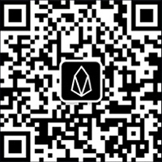

# Eos World Tour
## Year End Two-Day Special Edition

19th December 2018 12:00 UTC   
Trend 1: Sister Chain - Telos  
Lecturer : Douglas Horn

Scan QR Code with WeChat, add "EOS全球行小助手", and reply "1" to join the group:

## 2018 in Review 

Agenda 18th December 2018 12:00 - 13:40 UTC  
Organizer Speech - WhaleEx Charlie   
EOS World Tour Overview - Moran  
EOS 2018 in Review - EOSLaoMao  Yvonne   
Review Topic 1: Wallet - MEET.ONE Goh & TokenPocket Pan Fu   
Review Topic 2: Decentralized Exchange - WhaleEx  
Review Topic 3: Game - Royal Online Vegas DuanGongZhi 
Review Topic 4: CPU Lending - BankofStaked  
Review Topic 5: Governance - EOS Alliance Myra  
Q&A Session  

## 2019 Predictions 
Agenda 19th December 2018 12:00 - 13:40 UTC  
EOS 2019 Predictions - EOSLaoMao Moran  
Trend 1: Sister Chain - Telos Douglas Horn   
Trend 2: Security - SlowMist & EOSGuardian YuXian   
Trend 3: Explorer - EOS Park YangMing   
Trend 4: Application - EOS Knight Myeongjin Shin 
Trend 5: Cross Chain - BitPie WangHaiZhou   
EOS Overseas - EOS Detroit  Bobrigo Konsdorf  
EOS in China - EOSflytoMars LǚJie   
Q&A Session

---

# Eos 世界巡回
## 年终两天特别版

北京时间2018年12月19日20:00  
趋势 1: EOS姐妹链——Telos   
演讲者: 道格拉斯·霍恩（Douglas Horn  ）

微信扫二维码，添加“EOS全球行小助手”，回复“1”，加入讨论群：

## 2018热点

2018年12月18号日程（20:00 - 21:40）  
组织者演讲 - 鲸交所（WhaleEx） Charlie  
EOS世界巡回概述 - 赵余（Moran）  
EOS 2018回顾 - EOSLaoMao Yvonne   
回顾主题 1: 钱包 - MEET.ONE Goh & TokenPocket 付盼  
回顾主题 2: 去中心化交易所 - WhaleEx  
回顾主题 3: 游戏 - Royal Online Vegas 段公子   
回顾主题 4: CPU租赁 - BankofStaked  
回顾主题 5: 治理 - EOS Alliance Myra  
提问时间  

## 2019趋势 
2018年12月19号日程（20:00 - 21:40）  
EOS 2019 展望 - EOSLaoMao 赵余   
趋势 1: 姐妹链 - Telos 道格拉斯·霍恩（Douglas Horn  ）  
趋势 2: 安全 - 慢雾科技 余弦 & EOSGuardian  
趋势 3: 区块浏览器 - EOS Park 杨敏  
趋势 4: 应用 - EOS Knight  Myeongjin Shin 
趋势 5: 跨链 - 比特派（BitPie） 王海舟  
EOS 海外 - EOS Detroit Bobrigo Konsdorf 
EOS 中国 - EOSflytoMars 吕杰   
提问时间  