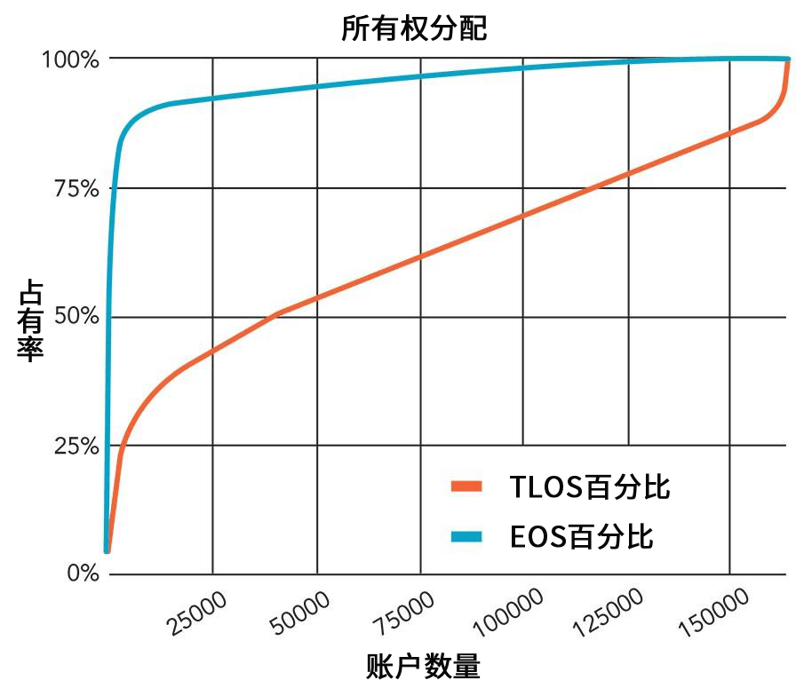
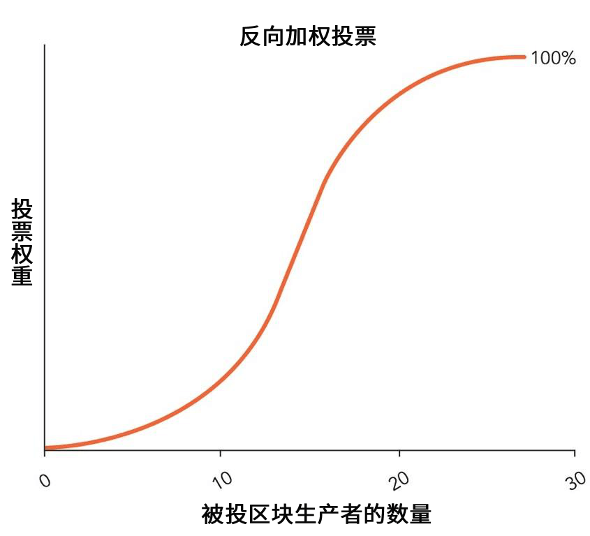
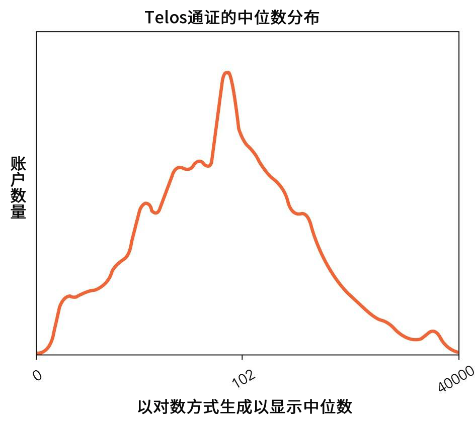
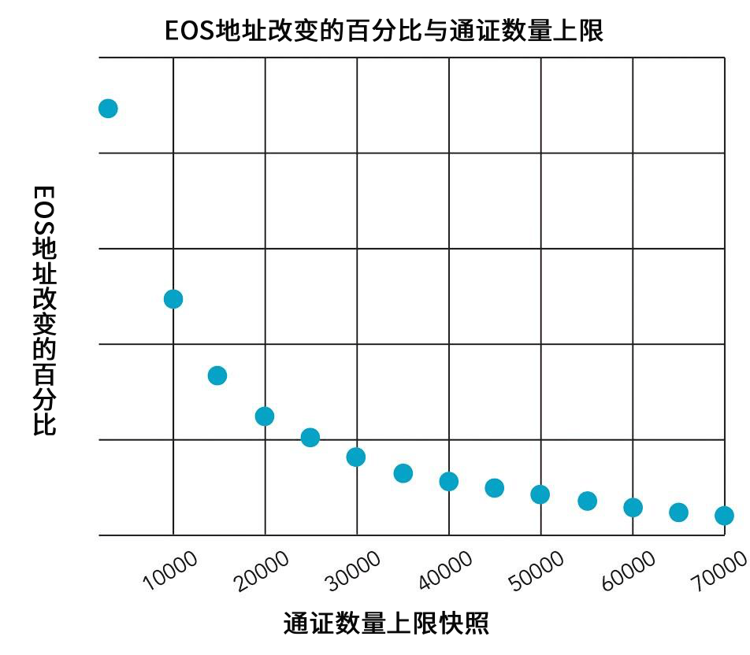
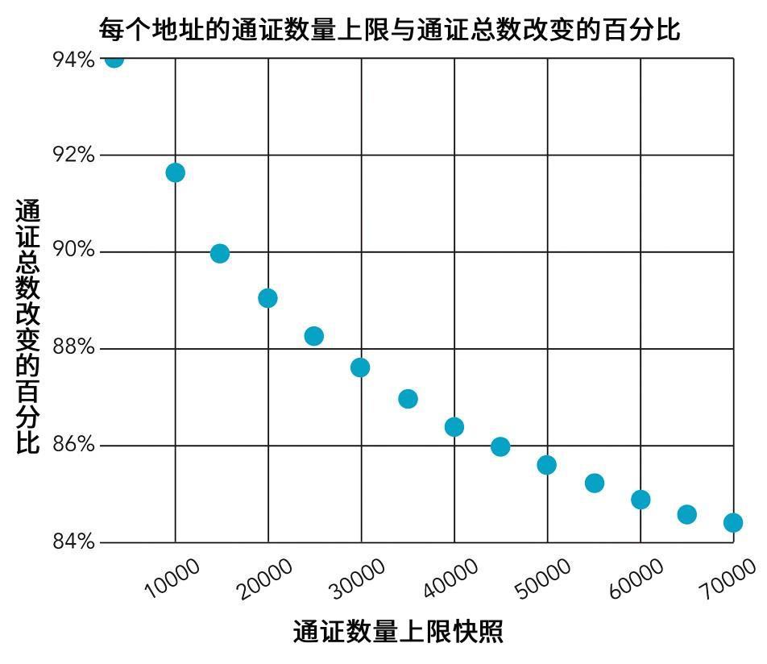
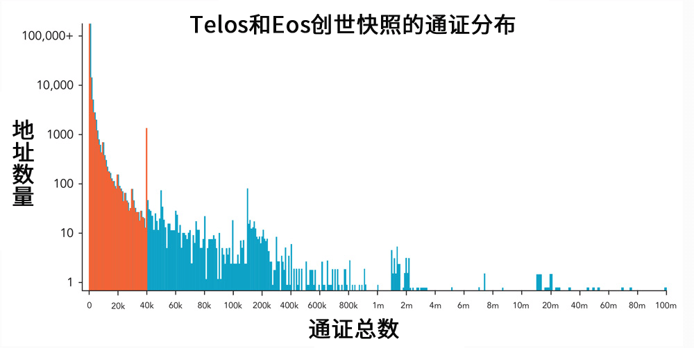

# 橡果（Telos）白皮书 v1.3

*一个可持续的去中心化 EOSIO 网络 作者：道格拉斯·泓恩（Douglas Horn）*

TELOS - 事物的终极目的。 （来自希腊语ΤΈΛΟΣ）

> “橡果的终极目的是成为一颗橡树。”——亚里士多德

**草案 1.2：2018年8月15日**

<!-- MarkdownTOC autolink=true levels=1,2,3 bracket=round bullets="-,*,+" -->

- [橡果（Telos）项目](#the-telos-project) 
  - [TELOS区块链](#the-telos-blockchain)
  - [Telos给你一个崭新开始](#a-fresh-start-with-telos)
- [Telos的优势](#the-telos-advantage) 
  - [对于开发者](#for-developers) 
    - [允许拥有专利权的去中心化应用（DApps）](#proprietary-dapps-allowed)
    - [较低的DApp开发成本](#lower-cost-dapp-deployment)
    - [较少的网络停顿](#fewer-network-pauses)
    - [增强的安全性](#enhanced-security)
    - [由区块生产者运营的公共测试网](#public-testnet-operated-by-block-producers)
    - [TELOS/EOS主网兼容性](#teloseos-mainnet-compatibility)
  - [对于通证持有者](#for-token-holders) 
    - [所有的投票都有意义](#meaningful-voting-for-all)
    - [每个通证具有更高平等性](#higher-equity-per-token)
    - [开发者专注于创造价值](#developer-focus-builds-value)
    - [较低的通胀率](#lower-inflation)
    - [被盗通证的预激活解决方案](#pre-activation-resolution-of-stolen-tokens)
  - [对于区块生产者](#for-block-producers) 
    - [公平的支付模式](#equitable-payout-model)
    - [公平的投票/反投票权重](#equitable-voting--inverse-vote-weighting)
    - [智能合约加强对区块生产者的要求](#smart-contract-enforced-block-producer-requirements)
    - [节点维护的常规停机时间](#regular-downtime-for-node-maintenance)
- [TELOS令牌分配](#telos-token-distribution) 
  - [比较分配](#comparative-distribution)
- [Eos问题，Telos解决方案](#eos-problems-telos-solutions) 
  - [Eos的问题以及Telos将怎样解决它们](#eos-problems-and-how-telos-will-solve-them) 
    - [问题：用户投票无关紧要 - 巨鲸统治网络](#problem-user-votes-don%E2%80%99t-matter-%E2%80%93-whales-run-the-network)
    - [问题：DAPP开发人员失去激励去使用网络](#problem-dapp-developers-are-disincentivized-from-using-network)
    - [问题：网络暂停风险](#problem-network-pause-risk)
    - [问题：备用BP没有适当地得到支付和定期测试](#problem-standby-bps-are-not-being-properly-paid-and-regularly-tested)
    - [问题：EOS RAM可能提高部署DAPPS的成本](#problem-eos-ram-prospecting-drives-up-the-cost-of-deploying-dapps)
    - [问题：Eos宪法未经批准](#problem-the-eos-constitution-is-unratified)
    - [问题：在启动时没有准备好裁决机构 ](#problem-adjudication-body-not-prepared-at-launch)
    - [Eos有高通胀](#problem-eos-has-high-inflation)
    - [Eos账户可能在3年后被没收](#problem-eos-accounts-can-be-forfeit-after-3-years)
- [Telos基金会](#the-telos-foundation)
- [启动一个完整的网络](#launching-a-complete-network) 
  - [投票钱包](#voting-wallets)
  - [治理](#governance)
  - [公投程序](#referendum-process)
  - [工人提案提交和投票程序](#worker-proposals-submission-and-voting-process)
  - [仲裁程序](#arbitration-process)
  - [仲裁机构](#arbitration-body)
  - [区块生产者执行](#block-producer-enforcement)
  - [中央信息中心](#central-information-hub)
- [Telos区块生产者最低要求](#telos-block-producer-minimum-requirements)
- [区块生产者支付](#block-producer-pay) 
  - [预计的Telos块生产者支付和美元价值](#projected-telos-block-producer-pay-and-usd-value)
- [在Telos网络里的仲裁](#arbitration-in-the-telos-network) 
  - [Telos仲裁程序](#telos-arbitration-process)
- [Telos被盗资金汇回程序](#telos-stolen-fund-repatriation-process) 
  - [Telos被盗资金汇回程序](#telos-stolen-fund-repatriation-process-1) 
    - [登记未被盗的地址](#registered-addresses-that-have-not-been-stolen)
    - [登记被盗的地址](#registered-addresses-that-have-been-stolen)
    - [来自销售的未认领的EOS令牌](#unclaimed-eos-tokens-from-token-sale)
    - [在EOS主网发布的交易所EOS TOKENS](#eos-tokens-on-exchanges-at-eos-mainnet-launch)
- [TELOS RAM投机预防](#telos-ram-speculation-prevention) 
  - [限制初始RAM分配](#limit-initial-ram-allocation)
  - [将RAM的增加与使用率绑定](#tie-ram-increases-to-network-utilization)
  - [鼓励TELOS基金会帮助稳定价格](#encourage-telos-foundation-to-help-stabilize-price-swings)
- [Telos交易所请愿程序](#telos-exchange-petition-process) 
  - [交换TLOS令牌创建请愿程序](#exchange-tlos-token-creation-petition-process)
- [Telos是证券吗？](#is-telos-a-security)
- [问答](#telos-faq)

<!-- /MarkdownTOC -->

# 橡果（Telos）项目

一个可持续的去中心化 EOSIO 网络

Eos系统为新经济带来了了不起的承诺。 不幸的是，高度集中化破坏了这一承诺。 仅1.6％的Eos持有者拥有90％的令牌。 令牌所有权，治理和区块生产者BP选举都受到大量“鲸鱼”地址的影响，这些地址可以将Eos推向他们想要的任何方向，而不考虑大多数令牌持有者，开发者，甚至网络的整体健康状况。

Telos是基于相同EOSIO代码的一个替代网络，旨在解决Eos的关键问题。 Telos网络提供：

1. 经济去中心化 - 没有鲸鱼地址
2. 区块生产者BP和备用BP的公平薪酬结构
3. DApp开发人员友好的专有DApps和较低成本部署
4. 额外的令牌持有者保护和被盗令牌的预激活解决方案

> “EOS的梦想，在修复它的中心化问题之前不会实现。” – Juan M. Villaverde, Weiss Ratings

## Telos区块链

Telos forks EOSIO code into a new blockchain and updates the following elements:

- 通过将创世快照中每个地址的值限制为40,000 Telos（TLOS）令牌，消除少数“巨鲸”的极端经济实力。
  
  - 消除了巨鲸对区块生产者选举和令牌持有者投票的控制。
  - 如果他们同意发行TLOS并分发令牌，在交易过程中将请求在其快照时为其EOS所有者创建TLOS令牌，每个账户持有者的上限为40,000个。
  
  

- 修改区块生产者（BP）和备用BP的支付模型以更好地保护网络。
  
  - 一个固定的21个BP加上30个基于投票产生的备用BP。
  - 在区块生产者和备用生产者之间平衡薪酬。 所有BP将被支付相同的金额，所有备用BP将被支付50％的BP费率。
  - 备用BP将定期（每3-7天）轮流进行一小段时间生成区块以取得报酬，以及证明其已准备好生产。
  - 无法连续生成180个区块的活跃BP将暂时被备用BP替换（在30分钟后，而不是Eos规则下的3小时后）。 3 hours under Eos rules). 
  - BP和备用BP因未生成/错过的区块而受到处罚。
  - This model will reduce incidence of network pauses due to 6 or more BPs becoming inactive.
  - **Active** BPs and standby BPs will have a clear minimum requirement in terms of information disclosure, practices, and hardware/connectivity – any that do not meet minimum will be prevented from serving regardless of voting.
  - Statistics on BP/Stand-by performance will be published to empower voters towards electing more reliable BPs.
- Telos代码审查/测试 
  - 区块生产者或由他们选出的机构将审查代码的安全性和价值。 
  - 新的代码版本将在主网络激活之前，在一个专用的测试网络上进行实时测试，这个专用网络由所有BP和备用BP维护。
  - BP和备用BP将根据专用测试网络的结果协调更新。
- Telos DApp开发人员可以将其DApp的原始代码部分指定为专有或开源。 （所有Eos DApps必须是开源的，这将限制许多潜在开发者的参与。）
- Telos将年度通胀率降至2.5％，而不是5％。
- Telos地址在不使用3年后不会被销毁。 Eos的这个功能是不公平和不必要的，不会在Telos中实施。 However, genesis Telos accounts created by the Eos genesis snapshot must be used at least once by their owners within one year to opt in to the system or they will be removed.

Telos将由参与Eos Mainnet Launch Group（EMLG）的Eos BP候选人联盟发起。 这个小组非常精通启动和运行主网的机制，因为它之前已经这样做了。

我们将分发一个全新的令牌TLOS，给Eos创世快照中列出的那些人。将稍做几点改动：

- 所有创世地址的上限为40,000 TLOS。
- 所有可以证明在发行/发射前被盗的地址都将被返回真正的所有者手中。
- New tokens will be generated to create the Telos Founders Rewards Pool (TFRP) to compensate the founders and the Telos Community Rewards Pool (TCRP) to compensate community members promoting Telos, and to fund the Telos Foundation – a promotional organization for funding work important to the Telos network outside the worker proposals system.
- 交易所同意买卖TLOS，并在快照时将TLOS通证分发给他们的EOS通证持有者，就可以请求由ABPs或BPs重新创建账户。每个账户持有人的上限为40,000。

由于来自希望接收令牌的客户的压力，交易所可能会列出TLOS，从而提供买卖方法。

Telos网络很可能更加稳定，因为区块生产者BP将通过广泛社区基于能力的投票而不是少量有从属关系的巨鲸进行选择。 另外，未能生产区块的区块生产者将在30分钟内（180个错过的区块）轮换出来，而不是3个小时。 此外，备用BP将被启用，并且需要每3-7天生成一个块以证明它们时刻准备就绪。 这种半定期计划为BP提供了维护和更新服务器所需的停机时间，从而降低了运营成本。 它还把更多的备用BP加入到治理中，因为备用BP的投票将影响BP投票。 这种方法意味着可以验证备用BP的能力和得到更高的网络弹性（可能减少网络暂停）。

开发人员可能更喜欢Telos系统，因为他们可能将某些DApp指定为专有，因此值得他们进行开发投资。 Telos网络将通过保持RAM可用性与网络需求相对应来降低部署成本，以减少早期参与者的RAM囤积。 这应该使部署DApps的成本低于在Eos上（的成本）。 在所有其他方面，Telos网络将与Eos主网软件保持兼容，以便DApps可以在任一网络上互换运行。

可以预期令牌持有者更加投入，因为与Eos相比，他们的投票更为重要。 Eos只有巨鲸的选票真的重要。 像Weiss Ratings这样的分析师可能会给予Telos更高的估值，因为他们已经警告集中化是Eos系统的一个严重问题，并建议对大型账户进行有限投票和吸收更多的BP - 这两者都是Telos做到了。 TLOS令牌供应将是EOS的五分之一到三分之一，具体取决于交易所参与。 鉴于所有这些优势，TLOS可能比EOS具有更大的价值。

## Telos - 一个崭新的开始

Eos主网的发布揭示了该系统的许多重要缺点。 我们很幸运从中学到了东西。 其中许多问题将及时得到解决。 Telos的优势是可以从新开始，可以直接处理这些问题，并在发布时立即解决最紧迫的问题。 Telos网络为在网络上运行EOSIO软件提供了新的开始，该网络专注于为DApp开发人员和令牌持有者提供明确而直接的价值。 最终，Telos可能会提供一个创新解决方案的测试平台，这个测试平台EOS主网可能会采用。 目前，Telos旨在成为一个有成本效益的，高度可靠的网络，用户可以免费加入，开发人员可以负担得起部署他们的DApps。

# Telos的优势

Telos是基于Eos的新网络。 It offers many advantages over the Eos Mainnet.

对于开发人员

    - 允许专利的DApps
    - 降低DApp部署成本
    - 网络暂停较少
    - 增强安全性
    - 公共测试网由BPs运营
    - Telos/Eos主网兼容性
    

对于通证持有者

    - 所有人的投票都有意义
    - 每个通证的权益更高
    - 开发者专注创造价值
    - 更低的通胀率
    - 被盗通证的预激活解决方案
    

对于区块生产者

    公平的支付模式
    公平投票/反投票权重
    智能合约强制执行区块生产者要求
    节点维护的定期停机时间
    

* * *

## 对于开发者

Telos网络旨在为开发人员提供可靠，经济，管理良好的网络，以释放DApp。 Telos与Eos主网络相比具有以下优势：

### 允许专利的DApps

在Eos主网上运行的所有DApp代码都必须是开源的。 （Eos宪法：第VII条）Telos不会强迫开发人员开源他们的代码。

### 降低DApp部署成本

Telos网络将依实际使用比例来管理RAM需求。 这将限制早期RAM囤积并保持部署DApps的成本更加经济实惠。

### 更少的网络暂停

Telos网络使用区块生产者系统，该系统每天替换所有备用BP进行区块生产，以证明所有备用BP都能够在每次调用时生成区块。 该系统还允许任何不可运营的BP在错过30分钟（180个连续块）之后暂时换出，而不是在Eos主网上的3个小时。 这降低了由于6个BP在任何给定时间变为非活动状态而导致强制网络暂停的风险。

### 增强的安全性

Telos通过为Telos区块生产者添加强制性最低技术和信息披露要求，扩展了Eos网络的安全性。

所有Telos BP和备用BP都必须在BP专用测试网上有一个节点，在实施之前可以测试新的补丁*。 这通过在实施之前披露新的故障来增加网络安全性，并允许BP之间更好的更新协调以减少死链的事件。

（*已知漏洞的紧急安全补丁除外。）

### 公共测试网由BP运营

所有Telos区块生产者和备用BP都需要将一个节点贡献给与Telos主网相同的完整且开放的测试网络。 这有助于应用程序开发和测试。

### Telos / Eos主网兼容性

Telos网络运行与Eos主网相同的EOSIO软件，因此为Eos编写的DApp可以在Telos上运行。 Telos网络上唯一的代码改动，与BP如何被支付，选择和音不合规暂时被从服务中删除有关。 所有其他差异都来自于创世纪快照的修改，宪法变更和组织原则。

* * *

## 对于令牌持有者

Telos令牌（TLOS）优于EOS令牌：

### 所有人的投票都有意义

Telos创世令牌所有权限制了所有创世纪账户上限为40,000个TLOS令牌。 Telos基金会拥有的地址不能投票。 Telos基金会拥有的地址不能投票。 因此，Telos令牌所有权是任何加密货币网络中其中一个最均衡比例的。 与Eos成员相比，Telos成员在网络治理方面拥有更为平等的发言权。

### 每个令牌更高权益

每个EOS令牌代表Eos网络总值的1 / 1,000,0000,000。 由于Telos有较少的令牌，因此每个TLOS令牌代表Telos网络值的大约1 / 330,000,000 *。 对于相同数量的令牌，这是网络所有权百分比的3倍以上。

（*取决于为其EOS令牌所有者激活TLOS令牌分发的交易所总数。）

### 开发者专注建立价值

任何基于Eos的网络的价值最终都将反映网络对开发人员部署DApps的有用性。 Telos通过降低DApp部署成本和部署专有代码的能力为开发人员提供额外的价值。 随着时间的推移，这些功能可能使Telos网络对开发人员更具吸引力和更有价值。

### 更低的通胀

Eos通胀率定为每年5％。 Telos的目标是每年通胀2.5％。 TLOS令牌通胀率将比EOS低50％。

### 被盗令牌的预激活解决方案

Telos基金会和ABP将提供一份智能合约，允许任何被盗的EOS持有人在Telos主网启动之前证明其所有权。 这会将令牌返还给他们的合法所有者，并防止其他成员无意中购买可能因盗窃而被冻结的令牌。

* * *

## 对于区块生产者

区块生产者验证交易，提供网络安全性，并在区块链上执行关键的治理角色。 为了吸引最好的区块生产者加入Telos网络，我们已经实施了以下改进：

### 公平的支付模式

Telos区块生产者系统由21个BP和30个备用BP组成，根据用户投票排名。 每个区块生产者将获得与Telos 1％通胀相同的每日份额。 每个备用区块生产者（最多30个）将获得前21个块生产者收到的金额的一半。 每个备用区块生产者将每3-7天轮换一次生产区块以“获得他们的保留”并证明他们可以不断地履行其职责。 对于任何错过的区块，区块生产者将受到处罚，并将向Telos选民提供统计数据。

### 公平投票/反投票权重

在Eos投票系统中，巨鲸可以选举他们选择的任何区块生产者。 想要只支持他们自己的附属区块生产者的选民可以通过不投票给其他任何人来增加他们的选票价值 - 这会损害投票系统。 Telos没有巨鲸，因此区块生产者只需要说服TLOS令牌持有者的广泛集体，他们有很强的候选资格。

此外，Telos区块生产者投票是“反向加权”，这意味着如果您只投票给1或2个区块生产者，您的投票权重将低于您投票给30个BP的投票权。 这鼓励大多数Telos成员去了解更多关于区块生产者候选人。 并阻止那些只为自己及其分支机构投票的人。

### 智能合约强制执行对区块生产者的要求

Telos维持区块生产者的最低标准，使其成为合格的候选人。 这些标准基于安全性，服务器容量，信息披露以及参与公共和私有测试网。 从主网激活时起，这些标准将由智能合约强制执行，并且任何不符合要求的区块生产者候选人将无法成为BP，无论投票如何。 所有其他区块生产者候选人将自动上升等级填补队列，直到满足最低要求。

### 节点维护的定期停机时间

备用区块生产者将通过半定期安排每3天轮流生产几个小时来证明其可靠性。 这将使主要区块生产者经常有机会关闭节点以进行维护和升级。 这显著降低了操作成本。 该系统还确保所有备用BP随时准备履行其职责。

# Telos令牌分配

*Calculations & analysis by Ava Masucci*

Eos系统中令牌的分配是所有主要加密货币中最集中的其中一种。 而Telos分配是所有加密货币中最不集中的一种。

- 90％的EOS令牌被仅1.6％的地址控制。
  
  
  
  更均匀的分配

最初将所有Telos地址的TLOS令牌数量限制为40,000，从根本上改变令牌分布，与EOS不同。方法如下：

- 删除86.5％的令牌供应或，865,000,000个令牌
- 减少在快照时注册的仅0.67％的地址或1,098个地址的持有的数量。
- 循环供应从约996,691,000 EOS减少到178,473,249 TLOS令牌。
- 假设另外78.6％（斐波那契水平）178,439,249将被重新加入货币供应量，因为为请求交易所创建的令牌，供应量将上升至约318,753,222。 
  - 将为ABP和Telos基金会创建额外的12,000,000个令牌，创造大约330,753,222个TLOS令牌的总货币供应量 - 约为Eos货币供应量的三分之一。
- 每个TLOS令牌将代表EOS令牌的网络权益的约3倍。

## 比较分布

将每个地址令牌数量限制在40,000改变了不到0.67％的注册地址。 以更大的数量限制令牌数量不会显著改变受影响的地址数量。

将令牌数量限制为40,000个会改变EOS令牌供应的约86％。 将令牌上限设置为更高的数字将使更少数量的令牌持有者获得更多权力。

# Eos问题，Telos解决方案

## Eos的问题以及Telos如何解决这些问题

作为Eos Mainnet Launch Group（EMLG）的投票和贡献成员，我们一直密切参与整个Eos主网启动过程。 这是去中心化决策的一个很棒的经验和实验，但它受到Eos中心化和Eos销售和流程要求引起的问题的影响。 通过消除Eos固有的极端中心化，Telos将解决许多这些问题。 Telos has more latitude to improve the tokenomics because it is not related to Block.one and did not raise any money through an ICO or presale. As a result, the Telos network may issue new TLOS tokens in any way it determines is best for the network.

### 问题：用户投票不重要 - 巨鲸控制网络。

由于Eos网络内部存在巨大的经济差异，并且因为只有21个区块生产者被指定运营网络并因此获得巨额奖励，因此巨鲸令牌持有者控制着Eos系统。 他们可以轻而易举地投票选出最多30位将遵循他们要求的附属区块生产者。 可以随时通过巨鲸EOS令牌持有者删除独立区块生产者。

Eos网络已经看到一些巨鲸的附属区块生产者未能生产区块，缺少必要的技术规划会议，并且没有向选民提供重要的信息披露。 这些巨鲸可能只是在Eos网络中吸收一大部分5％年度通胀，同时提供最低限度的服务，因为它们的投票能力使它们几乎无法被反对。

**Telos解决方案：**

Telos没有巨鲸。 令牌持有者将获得有意义的投票。

### 问题：DApp开发人员失去激励去使用网络。

Eos宪法规定Eos网络上的所有DApp和合同必须是开源的。 虽然这适用于许多合同，但它将限制网络上商业DApp的开发。 开发人员必须对他们创建的每个新产品进行大量投资;他们依靠保护他们的发明来收回这些投资。 如果商业DApp必须是开源的，开发人员将选择可以保护其作品的区块链。 此外，Eos主网正在经历对RAM预留的猜测，这将推高在网络上部署DApps的成本。

**Telos解决方案：**

Telos网络将允许某些应用程序被指定为专有。 那些在过去6个月内从网络（区块生产者，审判员，代码贡献者等）获得资金的人必须将任何DApp指定为开源。 为了阻止投机并降低部署DApps的成本，Telos网络将根据其实际的DApp使用情况释放RAM。

### 问题：网络暂停风险。

Eos网络需要“2/3 + 1”共识才能运行。 如果没有这个数量的BP运行，则必须暂停网络，直到2/3 + 1 BP处于活动状态。 实际上，这意味着如果21个活动Eos BP中只有6个无法生成区块，那么网络就会崩溃。 备用BP不会自动替换缺失的BP。 事实上，选上的BP在至少3个小时内无法被删除。 更加严重的问题是Eos备用BP没有定期测试他们替补和生产区块的能力。 此外，Eos BP没有强制执行的最低要求。 唯一的要求是获得投票。 危险在于，如果区块生产商停工，他们在三小时内不能被替换，替换他们的BP可能并没有准备就绪。

**Telos解决方案：**

Telos网络定期在备用BP中循环生成块（每个备用BP至少每3-7天一次）。 该循环系统还将临时替换任何在30分钟内未生产区块的活跃BP。 该系统在网络弹性上具有三个明显的优势：非生产性BP将被更快地替换，这意味着在任何给定时间，6个BP停工导致网络暂停的可能性将会明显降低; 备用BP将定期证明其准备就绪; BP将获得半计划的停机时间来维护和更新他们的设备。 此外，Telos使用智能合约来强制执行BP的合格性，确保BP满足最低技术要求。

### 问题：备用BP没有得到适当的支付和定期测试。

Eos备用BP的薪酬远低于前21名区块生产商，并且很少被要求证明其能力。 保持顶级节点基础设施成本高昂且无需证明其能力，备用BP可能会吝啬昂贵的改进和维护 - 特别是因为没有强制要求的最低要求。 没有持续的机制来测试备用BP的准备情况，主要BP没有机会进行计划停机，这增加了维护网络的挑战。 无法确定Eos主网在危机时刻是否能够正常运行。

**Telos解决方案：**

Telos有一个由多达30个备用BP的池，通过投票等级进行选择和支付。 备用BP的薪酬是前21名BP的一半。 为了获得这笔工资，每个备用BP将定期每3天循环生产几个小时，以确保所有被支付的备用BP能够在需要时立即投入生产。 此计划轮换意味着主要BP具有可预测的停机时间来维护其节点，从而降低了运营成本和提高可靠性。 未能生产区块的BP和备用BP将受到处罚。 该系统使得群组难以钻支付奖励系统的空子，并且灵活地阻止购买投票的行为。 Telos具有智能合约强制执行的最低要求（技术和信息），无论投票如何，每个BP必须满足这些要求。

### 问题：Eos RAM采矿推高了部署DApps的成本。

Eos网络发行的RAM比系统所需的多得多。 矿工已经开始尽早保留这个RAM，可能不打算使用它，但只是为了投机未来RAM的价格上涨。 这种投机导致RAM价格迅速上涨。 当DApps到达时需要这个RAM，它可能定价非常高，这使得在Eos上部署应用程序不必要地昂贵。

**Telos解决方案：**

Telos将推出仅4GB的RAM。 这将使人们希望在网络上启动的任何类型的初始DApp和空投成为能够启动，但不会激励RAM投机，因为矿工保留的RAM可以很容易地被进入系统的新RAM取代。 因此，人们更有可能仅仅保留他们预期的DApps所需的RAM。 BP将监视DApp RAM的使用情况，并在实际使用时根据需要添加新的RAM容量。 此外，Telos基金会将定期发布其认为合理的RAM价格的指导，并且可以购买低于该价格的RAM并以高于该价格的价格出售RAM以限制投机的意义。 Further, any time the current price of RAM is more than 10% above the published guidance price, the Telos Foundation will sell RAM to developers at the published guidance price.

### 问题：Eos宪法没有得到批准。

Eos临时宪法自我定义为不完整，需要修改和批准，然后Eos才能推进其许多法律和治理职责。 这表达了创始人的个人价值观和Block.one需要保持区块链的一致性，以免被视为创造了一个证券。 由于EOS令牌分配中的投票不平衡，被批准的宪法可能会支持巨鲸而不是普通用户的需求。

**Telos解决方案：**

The Telos ‘constitution’ is known as the Telos Network Operating Agreement (https://github.com/TelosFoundation/tips/blob/master/TelosOperatingAgreement.md) will be valid and enforceable as written as of network launch. There is no need to wait for a revised or ratified version. Every Telos user will agree to this via Ricardian contract the first time they choose to use their Telos account. Telos users certainly have the right to amend the constitution whenever they deem this necessary. Paragraph 32 (Amending) empowers TLOS token holders to ratify or amend the constitution using the ‘ratifyamend’ contract that will be available upon network launch, and when this happens it is more likely to express the desires and aims of common Telos users. 但是，如果不立即发生这种情况，网络将不会被视为未经批准。

### 问题：审判机构没有在发布时准备好。

Eos依靠裁决部门来解决所有争议。 但是，该机构尚未完全形成或准备好。 没有提供资金来促进这一点。 因此，诸如归还被盗资金等问题对于BP来说是一个难以解决的问题。

**Telos解决方案：**

Telos最初将在其主网启动之前解决许多司法挑战。 Telos仲裁组织（TAO）将立即准备就绪。 TAO将接受Telos章程的完整，不需要进一步批准。 对于它可以解决的案件，TAO也将有明确而有限的授权。 Telos基金会最初将资助TAO，以便在裁定涉及BP的案件时立即解决纠纷并保持没有（利益）冲突。 持续的TAO支持资金将来自仲裁费用。

### 问题：Eos通胀率很高

Eos通胀率为每年5％。 通胀率太高了，使货币贬值。 通货膨胀率为5％时，货币供应在短短14年内翻了一番。 世界主要经济体目前的目标是年通胀率为2％。 Eos通胀分配1％给BP，剩余部分根据BP对工作提案的投票进行划分。 因为巨鲸可以控制投票，所以他们有能力将这种通货膨胀推向其附属公司。

**Telos解决方案：**

Telos将保持较低通胀率，目标是每年2.5％。 仍有1％将被分给51个BP和备用BP（尽管它们之间的分配比较均等）。 其余的将用于支持裁决者，发展和其他职能。 由于某些DApp可以在Telos上专有，因此网络不需要向软件开发人员支付过多的资金。

### 问题：3年后，Eos帐户可能会被没收

根据Eos章程，任何未在3年内完成交易的账户将被没收，其EOS令牌将被重新分配。 许多长期储蓄者将措手不及并不公平地失去他们的令牌。 一旦丢失，没有方法可以上诉或恢复令牌。 这旨在保护系统资源并使人们与网络保持联系，但它过于严苛，并试图解决实际上尚未显示的问题。

**Telos解决方案：**

Telos will not have any token forfeiture in its initial Telos Network Operating Agreement. 如果TLOS持有者选择修改宪法以包括这个条款，那将是他们的选择，而不是强加于他们的东西。 Telos members whose accounts are created by the genesis will be required to access their accounts at least once within the first year after activation of the Telos mainnet to signify their opting-in to the network and its operating agreement. Genesis accounts that do not use the network within one year will be deleted.

# Telos基金会

Telos基金会作为促进和资助机构存在，以推进网络并为其他没有得到资金的网络功能提供支持。 Telos基金会的目的是向提供必要网络功能的团体提供资助，这些团体不能或未受到工人提案的支持。 在网络生命的早期阶段，工人提案可能难以筹集资金，因为这个流程刚刚起步，而且早期工人提案筹集的钱款的价值很小，而许多项目需要资源。 此外，一些团体可能需要不是来自BP的资金。 例如，Telos仲裁组织不能接受BP的初始资金，因为可能与BP有利益冲突，尽管这一初始资金至关重要。 通过让Telos基金会为这些流程提供资金，避免了这种冲突。

Telos基金会还旨在增加一种工具，以对抗当前在Eos上看到的RAM投资和失控的RAM价格。 Telos基金会将根据其认为的合理的RAM定价发布定期价格指导。 当RAM价格低于指导价格时，它可能会使用资金购买RAM来提高价格，当RAM价格高于指导价格时，它可能会出售先前购买的RAM以帮助降低价格。 这将有助于调整RAM的价格，避免大幅波动导致鼓励投机行为。 Telos基金会还将向需要RAM的小型独立开发者提供RAM补助，以便其在网络上部署DApp，优先选择开源DApp。 这将有助于确保新的创新者不会因为高价RAM而不能进入系统。

Telos基金会的目的是成为一个永久性的拨款资助组织，其选民不同于区块生产者。 Telos基金会将通过向选民提交工人提案来偿还已经分发的补助金来实现这一目标。 通过这种方式，社区可以决定是继续保留Telos基金会还是将其关闭。

Telos基金会是一个去中心化的自治组织，使用Telos基金会投票令牌（TFVT）通过智能合约进行投票 - 这是一种无价值的令牌，赋予其持有者投票权。 通过这种方式，Telos基金会可以投票决定资金的支付和选举自己的公共代表。 投票令牌将在发行时将分配在整个Telos社区，以鼓励广泛来自开发者，BP，作家和其他知名社区成员的的投票声音。 每个人将获得1到3个TFVT。 新的令牌将按季度分配给正在为Telos社区做出贡献的成员。 投票由智能合约执行，简单地多数投票的令牌通过投票。

The Telos Foundation voters are drawn from active contributors to the Telos community—as selected by the existing Telos Foundation voters. The initial group of Telos Foundation voters will be draw from contributors to the Telos Network creation and launch. All Telos Foundation Voter Token holders will be publicly announced and their voting token addresses will be associated with their identities so that each voter’s voting record will also be publicly recorded on the blockchain.

**Telos基金会在网络治理方面没有任何作用。 它不会用其令牌投票或在投票事项或BP选择上发布立场。 它的唯一职能是为有益的Telos项目提供资金，否则这些项目可能无法获得资金，并有助于稳定网络上RAM的价格。**

Telos基金会可能授予令牌的领域包括：

    对那些为Telos发布成功做出贡献的人的报酬
    为Telos网络上使用的有价值工具的开发人员提供补偿
    为Telos仲裁组织启动资金
    在必要时偿还选择的交易所用于发行TLOS的成本
    资助新工具的创建
    为平台提供广告和营销资金
    为那些因RAM投机者被高价格挤出而不能部署开发者提供RAM补助
    促进或保护Telos网络的任何其他功能
    

其中许多案件也可能通过工人提案获得资助。 Telos基金会将资助其投票成员认为没有通过投票建议获得充足资金的提案。

由金钱资助并受委托推广网络的基金会是加密货币中常见的实体。 许多区块链项目为其项目的Telos基金会版本建立了持续的资金。 Telos决定在任何特定时间将这些决定交给BP，以最好地支持Telos网络的去中心化。

# 启动完整的网络

Telos受益于EOS主网启动的教训。 在那次发布会上做出的一些决定已被证明是有问题的。 Telos将引入网络成功所需的所有工具来改进启动。

## 投票钱包

在Telos网络启动时，将为用户提供经过批准的投票钱包。 Telos正在与钱包开发商Scatter和Greymass *合作，以确保他们的钱包能够与Telos区块链无缝协作。

## Governance

Telos will have a full-force Telos Network Operating Agreement (like the EOS constitution) and all supporting governance documents upon launch addressing all areas of governance.

## 公投程序

除了全面的宪法之外，Telos将以公投投票合同的形式启动宪法公投程序。 将明确描述公民投票过程，任何Telos成员调用合同并提出公民投票。

## 工人提案提交和表决程序

工人提案是运行网络的重要部分。 在Telos主网络激活后，将为工人提案提供一份记录良好，基于智能合约的提交和投票流程。

## 仲裁程序

Telos白皮书包括仲裁过程的概述，该过程由多方智能合约驱动。

## 仲裁机构

当Telos主网激活时，Telos仲裁组织（TAO）将处于活跃状态。 Telos ABP和其他人正在积极寻找合格且感兴趣的人员来领导该组织。 为了消除利益冲突，TAO最初将由Telos基金会提供资金，之后由仲裁费和/或工人提案资助。

## Bp执行

由于选举出来的BP有可能在DPoS区块链中拥有巨大的权力，因此BP必须迅速监督对方的违规行为，如果（这些违规行为）未经检查，可能威胁网络安全。 去中心化Telos选民基础是一个重要的步骤，但如果没有选举产生的BP的警惕，中心化可能会出现。

Telos将修改regproducer智能合约中包含的Ricardian合同，成员必须执行这个合同以便注册为块生产者候选人。 现有合同要求BP候选人同意某些条款，但不建议如果违反这些条款应该采取什么措施。 因此，到目前为止还没有针对违规行为的执法措施。

修订后的Telos regproducer合同将明确规定被禁止的行为以及违规处罚 - 例如优先处理交易，并将要求所有其他BP执行。 为了促进这一点，将有一个任何BP都可以执行的智能合约，记录涉嫌违规的链条，并要求所有其他BP投票决定是否执行所需的处罚。 如果2/3 + 1多数票投票执行，则智能合约将立即执行。 无需其他操作。

## 中央信息中心

Telos将在TelosFoundation.io网站上托管各种一流的区块链工具，为Telos会员和其他感兴趣的团队提供便利的信息中心。 该网站将是非政治性的，并且对任何BP候选人都没有任何偏袒。

（* Scatter和Greymass不为Telos项目背书。 他们正在与Telos合作以确保其产品的兼容性。）

# Telos Bp最低要求

所有Telos Bp必须满足一系列最低要求才能提供服务，无论他们可能获得多少票。 这些要求既是信息性的，也是技术性的。 合规性将通过智能合约或类似流程强制执行，以最大限度地减少主观性。

每个BP候选人将至少提供：

**信息：**

    telosbp.json文件，包含有关公司构成，所有权，网站，社交媒体连接，关键管理联系人，关键技术联系人的信息。
    至少300个对等方的服务器连接信息。
    

**Technical:**

    两个主网节点（一个指定为BP）：不运行其他进程的专用服务器，具有8个内核的Intel Xeon处理器，128GB DDR3 ECC RAM，DDOS保护，100Mbps互联网连接，测试节点的延迟小于500ms。
    两个testnet节点（公共开发人员testnet和新软件的私有BP testnet）：Intel i7处理器，16GB DDR3 ECC RAM，DDOS保护，100Mbps互联网连接。
    

每个BP对最低要求的遵守将由智能合同和无利害关系团体监控，以确保合规性。 如果智能合约检测到Bp不符合要求，它将：

    向BP发出不合规通知
    24小时后，阻止BP服务
    所有BP投票将保持不变
    一旦该BP检测到BP再次符合要求达1小时，它将有资格服务并将返回其收到的投票所决定的等级。
    如果BP超过15天为满足合规的最低要求，它将被取消注册，并需要再次运行regproducer。
    通过起草每个BP候选人必须致电的生产者合同中包含的Ricardian合同，将确保遵守智能合同无法验证的一些要素。
      * This contract will clearly list actions that block producer candidates are prohibited from taking clearly linked to penalties that all other block producers must implement swiftly or be deemed in violation as well.
      * Strongly linking infractions and commensurate outcomes within the regproducer contract will allow swift and decisive action by other block producers, which is currently lacking in EOS mainnet governance.
    

Telos ABP的目的是使这些最小值能够使BP积极响应。 这些最低要求需要根据由BP的2/3 + 1投票时不时进行修订。 但是，值得注意的是，Telos网络是去中心化的，没有所有者，管理者或受托人，也没有由令牌持有者选出的BP投票之外的治理系统。 鼓励未来的BP，但绝不要求遵守ABP规定的任何意图。 Future block producers are encouraged but by no means required to abide by any intent stated by the ABPs.

# Bp薪酬

BP是任何EOSIO网络的重要组成部分 有21个BP随时验证网络。 还有一些备用BP的目标是，如果其他BP被网络淘汰，则能够随时介入以维护网络安全。

顶部BP和底部备用BP之间的薪酬非常不平等。 2018年7月3日，顶级区块生产商'bitfinexeos1'获得1,017 EOS（8,960美元），而收入最低的备用BP'sheleaders21'仅获得118 EOS（1,040美元），比率几乎为9：1。

为了使备用BP能够真正能够随时介入，他们需要能够支付得起昂贵的技术要求才能运行：企业级服务器，数据中心，DDOS保护以及员工。 在短时间内转换到这个角色并不容易。

如果支付率为9：1，备用BP将很难跟上领导者的技术和人员配备标准。 而且由于Eos中确实没有用于验证备用BP准备情况的现有流程，因此对于低于＃25左右的Eos备用Bp而言，理想的赚钱策略是使用BP不能胜任的节点插件并将其全部预算用于社交媒体获得选票。 这不是网络需要备用BP去做的事情，但是薪酬结构激励他们的去这样做。

Telos薪酬结构通过在全职的选举出来的BP和备用BP之间保持2：1的薪酬来解决这个问题。 这使得备用BP能够保持能力跟上选定的BP。 该系统还要求他们每隔3-7天进行一次生产，持续6小时。 最终机制可供讨论，但一种可能的结构如下：

每个选举产生的BP每周轮换12小时。 每个备用BP每5天轮换一次，每次6小时。

这降低了BP运行服务器的成本，因为它们可以安排每周维护和更新，并强制备用BP准备好真正保护网络。 所有BP和备用BP将因未生产的区块而受到处罚。

下表展示了在网络开始时BP和备用BP的薪酬

## Telos网络中的仲裁

| **USD-TLOS Price**             |             |      | $2.50        | $5.00          | $10.00         | $15.00         | $20.00         |
| ------------------------------ | ----------- | ---- | ------------ | -------------- | -------------- | -------------- | -------------- |
| **TLOS Money Supply**          | 331,753,222 | TLOS | $829,383,055 | $1,658,766,110 | $3,317,532,220 | $4,976,298,330 | $6,635,064,440 |
|                                |             |      |              |                |                |                |                |
| **Daily Inflation**            | 0.0027%     |      |              |                |                |                |                |
| **Total Daily Pay**            | 9,089.13    | TLOS | $22,722.82   | $45,446        | $90,891        | $136,337       | $181,783       |
| **BP Daily Pay(@ 21 BPs)**     | 252.48      | TLOS | $631         | $1,262         | $2,525         | $3,787         | $5,050         |
| **SBP Daily Pay(@ 30 SBPs)**   | 126.24      | TLOS | $316         | $631           | $1,262         | $1,894         | $2,525         |
|                                |             |      |              |                |                |                |                |
| **Monthly Inflation**          | 0.0833%     |      |              |                |                |                |                |
| **Total Monthly Pay**          | 276,317.26  | TLOS | $690,793.15  | $1,381,586.29  | $2,763,172.59  | $4,144,758.88  | $5,526,345.17  |
| **BP Monthly Pay(@ 21 BPs)**   | 7,675.48    | TLOS | $19,189      | $38,377        | $76,755        | $115,132       | $153,510       |
| **SBP Monthly Pay (@30 SBPs)** | 3,837.74    | TLOS | $9,594       | $19,189        | $38,377        | $57,566        | $76,755        |
|                                |             |      |              |                |                |                |                |
| **Annual Inflation**           | 1%          |      |              |                |                |                |                |
| **Total Annual Pay**           | 3,317,532   | TLOS | $8,293,831   | $16,587,661    | $33,175,322    | $49,762,983    | $66,350,644    |
| **BP Annual Pay(@ 21 BPs)**    | 92,153.67   | TLOS | $230,384     | $460,768       | $921,537       | $1,382,305     | $1,843,073     |
| **SBP Annual Pay(@ 30 SBPs)**  | 46,076.84   | TLOS | $115,192     | $230,384       | $460,768       | $691,153       | $921,537       |

(USD values are for reference only.)

# Arbitration in the Telos Network

Telos ABP打算澄清他们对Telos网络中仲裁的作用和过程的意图。 他们打算在Telos主网激活之前创建一个功能性的Telos仲裁组织（TAO）。

在Telos，仲裁的主要作用是解决智能合约的非确定性因素，仲裁员充当人类“神谕”来解决争端。 其次，当智能合约的实际行动与李嘉图合同中记录的意图和手段不一致或者涉嫌违约时，仲裁员将与当事人一起寻求结果。 仲裁并不是通过指示BP冻结或修改账户，来解决被盗账户的问题。 这个功能被认为通常没有实际意义，因为窃贼可以比冻结账户更快地移动令牌，因为EOSIO具有强大的安全功能，可以防止被盗。 业主有责任保护自己的地址安全。

这是Telos ABP的目的。 但是，值得注意的是，Telos网络是去中心的，没有所有者，管理者或受托人，也没有令牌持有者选出的BP投票之外的治理系统。 鼓励未来的Bp，但绝不要求遵守ABP规定的任何意图。

## Telos仲裁程序

1. TAO遵循Telos仲裁的一套核心规则。 如果双方同意，其他规则系统（例如美国仲裁协会）可以在这些系统之上分层。
2. TAO仲裁员的意图是充当非确定性合同的人类“oracle”（数据/信息/决策来源）。 理想情况下，仲裁员是在智能合约执行开始时指定的。
3. 仲裁案件通过争议仲裁智能合约（DASC）提交，其中包括有关争议性质的信息，无论是新争议还是上诉，以及仲裁费用。 
  - 如果案件已经清除了会员的账户，他们可以要求免费仲裁TAO会员可以选择免除费用或使用工人提案或Telos基金会的赠款来支付这些费用。
4. 仲裁员将要求双方发表声明和信息。 
  - 当事人向仲裁员和对方提交陈述和信息。
  - 当事人可以向另一方的陈述和其他证据提出反驳，以处理异议声明或证据。
  - 仲裁员可以询问他或她认为必要的任何问题以确定结果。
  - 仲裁员仅根据与Telos章程和规则有关的证据以及有关智能合约的条款作出判决。 如果它们不同，则Ricardian合同记录的意图将比源代码更具意义。 该决定作为oracle数据点传输给智能合约，或通过案例的DASC传递给BP作为仲裁员命令。
5. 仲裁员的行为应直接执行（在事先协议允许的情况下），或者提交给BP执行。 此类提交将采用订单在区块链上执行的交易以及仲裁员的私钥批准。
6. BP必须在12小时内执行DASC的命令。

- TAO仲裁员的意图不是试图退还因盗窃而损失的资金。 Telos和EOSIO软件具有高级别的安全保护。 这是防盗的最佳方法。 盗贼的行动太快，无法通过仲裁来打败。 这一过程只会进一步蔓延到可能获得被盗令牌的无辜方。 
  - 在Telos启动之前，所有可以提供所有权的加密证明的被盗资金，都将通过分配新的所有者提供的密钥返还给原始所有者。

# Telos被盗基金返还程序

在某些情况下，在Eos ICO和注册过程中，某些地址未正确注册，未注册或在诈骗中错误注册。 Telos ABP打算在网络发布之前尽可能纠正这种情况，并向应该合理拥有它们的人提供TLOS令牌。

为了实现这一目标，ABP将寻求贷记那些能够使用加密密钥证明他们是丢失或被盗令牌的真正所有者的人。 这包括最初不是在快照之前注册的EOS令牌。 以下是在Telos网络启动之前将资金返还给合法所有者的流程。

## Telos被盗资金返还程序

### 未被盗的注册地址：

    1. 无需采取任何行动。 您的TLOS令牌将在网络上
    

### 已被盗的注册地址：

    1. 1. 地址所有者文件声明，提供：
    被盗地址
    来自以太坊钱包的密码签名作为证据
    一个新的EOSIO公钥，作为控制帐户的一对密钥对的一半 2. 地址将在10天内发布争议（没有识别信息）。
      任何其他用户都有机会提供证明所有权的加密证据。
    3. 3. 提供合法所有权加密证明的无可争议地址将使用Telos创世文件中提供的新公钥替换旧公钥。
    

### 令牌销售中无人认领的EOS令牌：

    1. 1. 未注册的令牌所有者提交索赔，提供：
    Eos ICO购买交易哈希
    购买以太坊钱包的密码签名作为证据
    一个新的EOSIO公钥，作为控制帐户的一对密钥对的一半 2. 提供合法所有权的加密证明的地址将在Telos创世文件中插入地址和新公钥。
    

### Eos主网上交易所的EOS令牌发布：

    1. 1. Telos ABP为交换提供了交换TLOS令牌创建请求流程，以便与ABP一起为其在快照时持有EOS的客户创建令牌。
      ＊交易所必须完成流程才能接收新令牌以分发给客户。
    2. 2. Telos ABP和BP不承担任何责任，并且不会对交易所持有的令牌采取任何行动。
    

Telos ABPs打算在Telos网络启动前根据以下理由进行密码验证，证明在以太坊注册或Eos投票阶段未注册或被盗，其理由是此修正是可能的并且可以验证。 我们认识到一些损失是由于以太坊注册过程以及在Eos主网发布时缺乏批准的消费级投票钱包。

The Telos network will adopt base layer arbitration to protect token holders from theft. Not all forms of theft may be recoverable, but arbitrators will have the ability to call for block producers to freeze accused accounts for a limited amount of time upon presentation of evidence of theft. Telos block producers will have authority for specific actions to demand restitution in accordance with a duly processed arbitration contract. The arbitration contract and Telos Arbitration Organization will be active from the time of the network launch.

# Telos RAM投机预防

RAM投机是Eos中已经出现的危险。 一些投机总是会出现在资源稀缺的健康市场中，但是当投机失控时，它会占用宝贵的稀缺资源并限制网络可用性。 为了最大化网络效用并使Telos网络成为部署DApps的经济高效的地方，Telos将实施以下策略以阻止猖獗的投机。

- 限制初始RAM分配
- 将RAM的增加和网络利用率绑定
- 鼓励Telos基金会帮助稳定价格波动

## 限制初始RAM分配

Eos在主网发布时分配了64GB的RAM。 这个数字远远超过网络上任何DApp所需的数量。 对于投机者而言，这是一个巨大的土地抢夺机会，以非常便宜的价格获得稀缺资源。 最终这个RAM将是有价值的。 这种“RAM抓取”将导致高度投机和繁荣 - 萧条周期，这对网络稳定性起反作用，并使部署DApps成为预算难题。 对于认真的开发人员而言，这是针对Eos网络的罢工，可能会让小型创新者完全放弃Eos。

为了鼓励开发人员并避免价格波动，Telos网络将推出4GB内存。 虽然这听起来很低，但它足以支持系统上任何真正的DApp或空投。 较低的数字可以激励人们不去投机Telos RAM，因为可以释放新的RAM，从而降低现有投机的升值。

## 将RAM的增加和网络利用率绑定

Eos主网正在讨论如何以及何时更改RAM供应。 增加可用内存将暂时降低价格，但最终会加剧投机，因为将来可能会释放更少的潜在内存。

Telos网络将新的RAM版本与利用率数据联系起来。 最初提出的价值是当在一段时间内持续使用的RAM>50％，将释放新的RAM。 这将把新RAM与网络增长联系起来。 The block producers will ultimately determine the network RAM supply via the ‘setram’ action.

## 鼓励Telos基金会帮助稳定价格波动

Telos基金会是一个独立治理的非管理机构，就像美联储一样。 其目标是通过拨款促进网络增长。 它拥有这些拨款，这也可以作为一种帮助阻止RAM投机的方法。

Telos基金会将定期发布其认为合理的Telos RAM价格指南。 当价格低于此指导价时，Telos基金会可能会购买RAM。 当价格较高时，它可能会卖出。 这是为了帮助稳定价格。 这种方法自然有其局限性，但预计会有助于抑制哄抬价格。 此外，Telos基金会可以选择以其公布的指导价格（不论当前价格）向开发商出售或租赁RAM，以鼓励一些开发人员在系统上构建。 When publishing its guidance price, the Telos Foundation will include published advice to the Telos block producers about when to release more RAM into the system. This decision will remain with the block producers, however. Any professionals hired by the Telos Foundation to set RAM pricing will be prohibited from trading Telos RAM on their own accounts.

为了确保小型创新者不会被高价格挤出网络，Telos基金会还将向这些开发人员发放一些RAM形式的赠款。 在这种情况下，它将支持开源DApps。

# Telos交易所请求程序

Telos指定的BP（ABPs）创建了以下流程，允许在快照时列出EOS的交易所请求通过创建新的TLOS令牌来为其Telos地址提供资金，这些令牌足以为当时的EOS所有者提供TLOS令牌快照（每个客户1：1到40,000 TLOS）。 Telos ABPs同意为完成该过程的每个交易所创建令牌。

Telos项目的目的是在Eos快照时为所有EOS令牌所有者提供TLOS（每个地址或交易所客户最多40,000）。 Telos ABPs鼓励未来的Telos BP遵守这一意图，并为请求过程之后的每个交易所创建所需的令牌。 但是，值得注意的是，Telos网络是去中心化的，没有所有者，管理者或受托人，也没有由代币持有者选出的BP投票之外的治理系统。 鼓励未来的BP，但绝不要求遵守ABP规定的任何意图。 因此，启动Telos网络的ABPs将只能在启动和激活之间的时间段内对处理交易所请求有完全控制权。 激活后，是否决定为任何请求交易所创建新令牌，将由当时21个选举的BP中的15个投票决定。

Telos ABPs建立了一个交流外联工作组，与所有Eos交易所联系，并在启动期间帮助指导他们完成整个过程。 重要的是要强调，只有在Telos启动期间才会创建用于请求交换的TLOS令牌，并由ABP保证。

## 交易所TLOS令牌创建请求流程

1. 交易所和Telos交流外联工作组（TEOWG）发起通信，双方都为此案件指定一名代表。 持有多个投资者的EOS令牌的投资基金也可以在此过程中申请。
2. 2. 交易所签署了一份意向书，交易TLOS令牌，并在Eos快照时将其提供给他们的EOS令牌持有者，每个账户的上限为40,000个TLOS令牌。 这份意向书记录了新令牌印刷的条款，包括交易所将同意不作为BP和不投票令牌，因为它们不是令牌的受益所有人。 （即永远不要从他们的交易所持有地址投票。）交易所和/或Telos网络可以对这一发展进行宣传。
3. 3. 交易所提供快照上所有交易所拥有的地址的标识以及所有权的加密证明，以及一份关于其下没有控制其他地址的声明。
4. 4. TEOWG提供当前Telos节点和客户端软件的当前副本以及部署所需的任何其他支持。
5. 5. 交易所在Eos快照时将帐户金额的匿名列表提供为CSV文件或类似文件。
6. 6. TEOWG检查交易所提供的账户清单，并在40,000个TLOS令牌上限制所有账户的持股。
7. 7. 交易所和TEOWG就将被创建的令牌的总价值和将要发送的地址（来自已识别的交易所拥有的地址）达成一致。
8. 8. 交易所公布了即将上市的TLOS令牌，并在发行日期分发给EOS所有者。 （这可能发生得比较早，但必须在此时发生。）
9. 9. TEOWG向Telos ABP提供交易所申请以及文件以供审查。 Telos ABP将协调TLOS令牌创建的安排与交易所发布的时间表。
10. 10. Telos ABPs投票决定创建令牌。 此交易的李嘉图合同要求交易所必须接受不从这些地址投票的条款，并且不运营BP候选人。
11. 交易所可以交易TLOS。

# Telos是证券吗？

从根本上说，Telos的TLOS令牌是否被视为证券并因此受到监管，将取决于各个国家执行证券法的机构。 然而，众所周知，美国证券交易委员会SEC在这方面已经开创先例，SEC最近的声明在这个问题上洒下了鼓舞人心的一道光。

2018年5月7日，美国证券交易委员会企业融资部主任威廉·欣曼在雅虎财经全市场峰会上发表讲话，并试图阐明在什么条件下将硬币或令牌视为证券。 他的演讲中出现了两个核心概念。 首先，证券在很大程度上取决于其向公众提供的性质 - 如何出售，做出何种陈述等。 Hinman的第二个关键点是，最初以本来应该以被视为证券方式出售的硬币或令牌，最终可能以不被视为证券的方式出售，基于去中心化和缺乏中心化的实体去控制它。 Hinman总结道：

**“基于我对以太现状，以太坊网络及其去中心化结构的理解，以太的当前报价和销售不是证券交易。”**

基于这两点，我们Telos ABPs依托Hinman的声明尽力发起这个有用的网络，正如以太坊因其去中心化而不是证券一样，TLOS也不会被视为证券，因为它比以太坊更加去中心化。 此外，Telos从未提供销售任何令牌或从投资者那里接受任何款项。

我们认为，根据Hinman先生和美国证券交易委员会的决定，TLOS令牌不应被视为证券，原因有两个：

首先，TLOS从未被以任何形式的ICO销售。 TLOS是一个全新的令牌，将在Telos主网络发布时创建。 Telos网络正在重新创建Eos令牌销售的修改版的所有权快照，以奖励那些付费使用Block. one创建的开源EOSIO软件的人。 要明确的是，所有投向这个ICO的资金都用于Block. one，没有用于Telos网络。 EOSIO软件是开源的，可以自由复制。 Telos ABPs决定通过授予与Eos购买匹配的令牌来奖励Eos的支持者，每个地址最高为上限金额，但与Eos或Block. one没有任何关系。 Telos没有出售任何东西，因此很难得出它曾是证券的结论。 TLOS is an entirely new token that will be created upon the Telos mainnet launch. The Telos network is recreating a modified ownership snapshot of the Eos token sale as a way to reward those who paid to have the open source EOSIO software created by Block.one. To be clear, all of the monies contributed to this ICO went to Block.one, none to the Telos network. The EOSIO software is open source and free to copy. The Telos ABPs have decided to reward the backers of Eos by granting tokens matching their Eos purchases, up to a capped amount per address, but there is no affiliation with Eos or Block.one. Telos did not sell anything so it is difficult to conclude that it ever offered a security.

其次，如果要推断TLOS令牌本来是一种证券，尽管从未被出售或出售，Telos网络完全去中心化的性质使得这一点变得没有实际意义。 Telos没有所有者，管理者或受托人。 该网络由验证节点运算符的独立网络（称之为BP）来管理。这些BP通过TLOS令牌持有者的智能合约投票连任。 TLOS令牌所有权很明显是所有加密货币中分布最均匀和最分散的。 甚至没有证据表明任何单一实体控制着Telos网络的1.5％。 Telos has no owners, managers, or fiduciaries. The network is administered by independent network of validating node operators called block producers who are continuously elected through the smart contract voting of TLOS token holders. The TLOS token ownership is notably one of the most evenly distributed and decentralized of all cryptocurrencies. There is no evidence that any single entity will control even 0.5% of the Telos network.

Telos网络最初将由6个指定的区块生产者（ABPs）发起，他们将启动网络发布，并将获得TLOS令牌。 被称为Telos基金会的实体将获得TLOS令牌，作为向必需的网络功能提供资金补助的一种方式。 当这些TLOS令牌被授予这些实体和所有TLOS令牌持有者时，令牌将没有面值，因为它们从交换价格中获得它们的价值（在它们未被列入世界上任何交易所的时候）或网络价值（在网络既没有启动也不能进行交易的时候）。

在Telos网络活跃并开放交易之前，6个ABPs将全部放弃他们的特权，并让位给通过至少15%TLOS令牌持有者投票选举出来的21个BP。 如果令牌持有者选举的BP与成员自己一期努力创建一个有效的，有价值的网络，TLOS令牌才会获得价值。

我们作为ABP的理解是，根据Hinman先生在美国证券交易委员会网站上发表的评论，TLOS令牌不是证券，我们在完全去中心化的网络中发行这些没有价值的所有权令牌，并不是证券要约。

ABP不是律师，所以这不应被视为法律建议。 坦率地说，这在很大程度上是未解决的法律。 然而，Hinman的陈述是明确的，并已在美国证券交易委员会网站上公布，表明他们已被正式批准。 根据这一定义，似乎很难将TLOS视为美国证券交易委员会定义下的证券。 Based on this definition, it seems difficult to deem TLOS a security under the US SEC definition.

**NOTE: THIS IS NOT LEGAL OR SECURITIES ADVICE. IT IS OUR INTERPRETATION OF PUBLISHED STATEMENTS BY THE UNITED STATES SECURITIES EXCHANGE COMMISSION AS THEY MIGHT APPLY TO TLOS TOKENS. SEEK COUNSEL FROM YOUR OWN PROFESSIONAL ADVISORS BASED ON YOUR NEEDS AND JURISDICTION.**

# Telos FAQ

**问：什么是Telos？**

答：Telos是一种基于EOSIO软件的新区块链网络。

**问：Eos和Telos有什么区别？**

答：Eos和Telos都是运行EOSIO软件的网络。 在一个系统上运行的任何智能合约应该在另一个系统上运行良好。 Telos修改了Eos创世快照和一些规则，使网络对大多数令牌持有者更负责任，对DApp开发人员更具吸引力，并且通常以更具响应性和可持续性的方式运行。

**问：什么是TLOS？**

答：TLOS是反映Telos网络所有权的令牌名称。 TLOS令牌就像一个EOS令牌，但是TLOS令牌将比EOS少大约3倍。

**问：你是否拿走了人们的EOS令牌？**

答：没有。 EOS持有人将拥有与Eos网络完全相同数量的EOS令牌。 这就是他们从Block.one购买的东西。 Telos是一个基于Eos网络的新项目。 Eos源代码是开源的，可免费提供给分叉。 我们决定在创世纪快照上为每个EOS令牌持有者提供相同数量的TLOS令牌，但是每个创世地址的最大值为40,000 TLOS。 This means that there will be no whales created from the Telos genesis, although the total token ownership of any account is unlimited once the network launches.

**问：Telos是空投吗？**

答：Telos是一个全新的网络，使用与Eos主网相同的EOSIO操作软件，只需进行一些小的修改。 它不是空投。 然而，TLOS令牌的分布类似于空投，因为任何拥有Eos令牌的人都将根据我们的创世令牌分配算法在其地址接收新的TLOS令牌。

**问：Telos创世纪令牌分配算法究竟是什么？**

答：简单来说，就是所有Telos创世地址都将获得与创世快照中相应的Eos地址相同数量的令牌，最多可达40,000个令牌。 Except for a few special cases: Addresses proven to have been stolen, phished, or misregistered, thereby depriving their rightful owners of them will be restored to new addresses controlled by their rightful owners; and new genesis tokens will be created to compensate the Telos Launch Group contributors and community members promoting the network, and to establish the Telos Foundation.

**问：如果您对所有账户设置上限，EOS持有人如何从交易所获得TLOS？**

答：TLOS BP能够通过2/3 + 1的投票创建新的令牌。 6个ABP同意为任何可以在快照上显示EOS持有量的交易所创建新的令牌，这些交易所必须同意：交易TLOS; 不投票交易所账户; 并且要求和分发刚好足够的硬币，使快照时所有EOS持有者收到的硬币上限为每个账户40,000。 ABPs将有一个请求交易所创建TLOS令牌的流程，并请求它们承诺尊重所有有效的请愿书。 （需要对6个区块生产商中的5个进行投票才能实现这一目标。）一旦Telos网络激活并且选出的BP验证网络，将对21个区块生产商中的15个进行投票，以便为交易所创建新的代币。

**问：为什么限制创世地址的TLOS为40,000个？**

答：最大的1,050个Eos地址控制着大约90％的EOS令牌，因此完全控制了BP的选举，他们的投票，最终控制了整个网络。 这使得系统严重中心化。 通过限制创世地址40,000个TLOS - 大约90％的所有权 - Telos网络将成为现存最均匀分布的主要区块链之一。 162,930个地址将具有与EOS一样多的TLOS。 The total TLOS token supply will be lowered to approximately 200-400,000,000 TLOS tokens depending on how many exchanges petition to recreate their wallets.

**问：Telos地址可以拥有超过40,000个TLOS吗？**

答：是的。 40,000 TLOS上限仅适用于网络创世账户。 之后，地址可以保留任何数量的TLOS。

**问：您是否仍需要15％的TLOS令牌持有者投票启动主网？**

答：是的。 但是，由于地址上限且Telo基金会地址永久被排除在投票之外，启动所需的总票数将减少。 这将代表更广泛的有代表性的各个TLOS令牌持有者群体。

**问：Telos主网启动和激活有什么区别？**

答：Telos主网启动是开始运行Telos网络的过程，允许BP和网络验证投票。 激活是当TLOS持有者可以开始转移或以其他方式控制其令牌而不仅仅是投票的时间点。 激活将在有资格投票的TLOS令牌持有者中有15％投票支持BP和主网激活，并且至少40个BP候选符合最低BP要求的24小时后开始。

**问：如果交易所地址不能投票，我的TLOS令牌是否可以投票，如果它们目前在交易所？**

答：一旦令牌离开交易所并在您自己的Telos地址，您可以投票。 个人所有者不能用其在交易所持有的令牌投票。 防止交易所账户投票要使交易所不能用客户令牌进行投票，因为这同样违反了Telos规则。

**问：这会伤害Eos网络吗？**

答：Eos网络成功或失败取决于它自身的价值。 我们希望它成功，因为我们都在这个项目上投入了大量资金（和精力）。 然而，Eos主要网络版本已经揭示了Eos区块链难以解决的系统问题。 “巨鲸”已经表明，他们通常只投票支持他们自己的BP合作伙伴，甚至还会利用奖励系统来伤害其他BP - 一旦工人提案出现，这也可能是预期的。 Eos网络由几个巨鲸账户控制。 我们提供了一种全新的方法，所有令牌持有者的声音都很重要。 Telos还希望提供一个测试平台，来测试那些最终可能被Eos主网采用的新想法。 通过这种方式，我们希望加强Eos。 In this way we hope to strengthen Eos.

**Q: If these changes will fix the network, why doesn’t Eos make them?**

A: Block.one sold EOS tokens in their tokensale. They accepted money for tokens and made certain representations. They can’t easily change the results of their sale—especially by reducing the tokens of their largest contributors, which is really the key change that fixes the system. Telos is a completely new system that never took money from nor made promises to anyone. We intend to build a network using the open source Eos software (that we all helped pay for) to create an entirely new network that better represents the true purpose of Eos.

**Q: Can I buy and sell TLOS tokens? What are they worth?**

A: TLOS tokens will not gain value until the Telos mainnet launches and they are able to be traded. In practical terms, TLOS will gain real value when exchanges accept them to trade against other cryptocurrencies. We expect that this will happen because exchange customers will demand that they be given access to their tokens. The technical requirements for listing TLOS will be identical to EOS so we expect little resistance on that point. Once tokens are freely trading on exchanges they will find their value based on supply and demand. The TLOS token supply will be between one-fifth and one-third that of EOS, and the Telos network should be as good as or better than Eos. Telos will also not have any “whale” addresses which often are responsible for price manipulations in other coins.

**Q: Are you selling TLOS tokens?**

A: We are not selling any TLOS tokens. We will use the Eos Snapshot with the following changes: 1) Capping all addresses at 40,000; 2) Creating a process for exchange addresses to petition the BPs to create TLOS tokens for their EOS snapshot owners by listing and distributing TLOS tokens (up to 40,000 per account holder); 3) Providing new public keys to EOS token holders who can prove that their tokens were stolen or misregistered; 4) Adding 6M new tokens to form a Telos Founders Reward Pool, 1M new tokens to form a Telos Community Rewards Pool, and 6M TLOS tokens to the Telos Foundation Ltd, to support network needs that cannot otherwise be funded. These tokens currently have no value and will only gain value if the Launch Group and Telos Foundation can create a valuable network. The Telos Foundation pledges to never vote its tokens.

**Q: Who are you and why are you launching Telos?**

A: We are a group of Eos block producer candidates who have contributed to the system, run testnets, and taken part in the Eos Mainnet Launch Group that voted to unanimously launch the mainnet. We believe in the promise of Eos, but we have come to be concerned that the current system is deeply flawed due to the overwhelming power of Eos token holders with enormous holdings. We hope that Eos can overcome this problem, but in the meantime, we want to launch a new, more decentralized network using the Eos technology.

**Q: Can Eos block producers also be Telos block producers?**

A: Absolutely! We hope they will since they know how to run EOSIO nodes well. Anyone who meets the minimum requirements for a Telos block producer may submit themselves for voting.

**Q: Can developers make their code proprietary?**

A: Yes. If the developer has not accepted payment as a block producer, code reviewer, or worker proposal recipient in the past six months, they can designate the original code in a DApp as proprietary. Any underlying open source code that the DApp is built upon will remain open source, of course. By contrast, all smart contracts running on the Eos network must be open source according to the Eos Constitution.

**Q: What if Telos users don’t want to use proprietary software on the blockchain?**

A: Each smart contract will designate if portions of its code are proprietary. Telos members will be able to choose whether or not they wish to work with proprietary smart contracts or only open source contracts.

**Q: When will the Telos mainnet launch?**

A: The Telos Launch Group will hold a series of “go/no-go” votes about launching the Telos mainnet starting on September 28, 2018. To vote “go” each Contributor will need to agree that a series of promised elements (e.g. arbitration, governance, ratification, plus all technical requirements) have been delivered sufficient to launch a complete and successful network. Once a majority “go” vote is reached, the network will be launched by the ABPs until it receives both 15% of all outstanding Telos votes (Telos Foundation addresses), and at least 40 Telos block producer candidates who meet the minimum requirements. At this point the ABPs will resign any special powers and 24 hours later the Telos mainnet will activate for transactions. In other words, we will wait for a groundswell of support from both the original Eos token holders and a group of highly qualified technical block producer candidates. We believe that this will indicate a true mandate for the Telos network.

**Q: How are Telos block producers paid?**

A: Telos will have 21 active block producers and up to 30 standby block producers sharing the 1% TLOS inflation. Each block producer will be paid the same flat rate and each standby will be one half of that rate. All will receive pay deductions for missed blocks.

**Q: Will the team launching Telos take a fee for its service?**

A: Launching the Telos network is an expensive and time-consuming venture. The people launching Telos include block producers, developers, social media marketers, arbitrators, and others working together in a largely decentralized way. Members of the Telos Launch Group will be compensated in the TLOS genesis file. A Telos Founders Reward Pool (TFRP) will be created in the Telos genesis file containing 6M TLOS (about 1.8% of the expected money supply). This fund will be distributed among members of the Telos Launch Group – an open-membership group established to create and launch the Telos network – based on tasks performed by members. The exact method of TFRP distribution is yet to be determined but will be formalized prior to network launch.

**Q: You say that Telos won’t have any “whales” but aren’t the TFRP recipients and Telos Foundation going to become whales?**

A: The Telos Foundation will never vote its tokens. TFRP funds will be broadly distributed among contributors in a manner to be determined soon. Distributions over a certain amount will unlock evenly over a 3-year period similar to how Block.one’s tokens vest. No TFRP recipient will be able to vote itself into the block producer ranks without the help of many TLOS token holders.

**Q: Why are TLG members being compensated?**

A: Members of the Telos Launch Group are taking a central role in creating and launching the Telos network. They are bearing the costs and contributing the effort to bring the network to life. To compensate their work and defray cost they incur, they are being granted new genesis tokens on the Telos blockchain distributed from the Telos Founders Reserve Pool. These tokens are of zero value at the genesis and will only gain value if the TLG, Telos Foundation, and other participants can launch a valuable network. This approach is in line with bounty programs common in cryptocurrency launches. The total amount of compensation for the many founders/bounty recipients is ~1.8% of the expected Telos token supply, which is a low number for cryptocurrency projects where large amounts of work are required and no funding has been sought.

**Q: What is the Telos Foundation?**

A: The Telos Foundation is a promotional arm of the Telos Network. Prior to the Telos mainnet launch, the Telos foundation will organize technical, informational, and marketing efforts to advance the Telos network. The Telos Foundation will manage the Telos genesis file subject to validation of the ABPs. Immediately upon the mainnet launch, the Telos Foundation will cede its authority to the ABPs to be governed by the Telos Constitution and voting rules.

After mainnet launch the Telos Foundation will function as an independent promotion and funding body for the Telos network. Its function will be to pay for projects that are not selected for worker proposals or that cannot yet be funded due to inadequate funds. (Particularly early in the life of the network.) The Telos Foundation may apply for worker proposal funds to reimburse funds dispersed as the goal is to create an ongoing fund that is not depleted. It will also seek to stabilize RAM prices by regularly publishing a guidance price and buying below that price, selling above it, and offering RAM for sale or lease to bona fide developers seeking to develop on the network.

The Telos Foundation is a decentralized organization that votes on its own issues via smart contract. It does not serve or seek any official governance position and will remain neutral on block producer candidates and proposals. Addresses owned by the Telos Foundation will never vote.